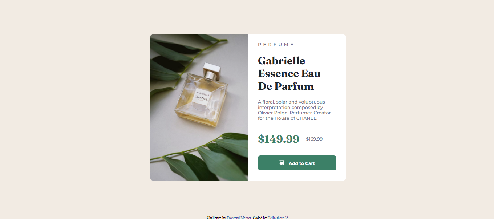
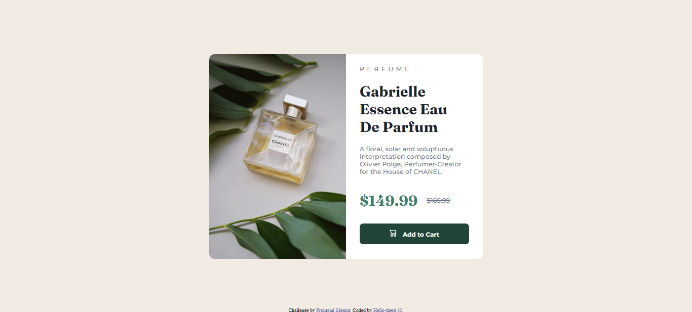
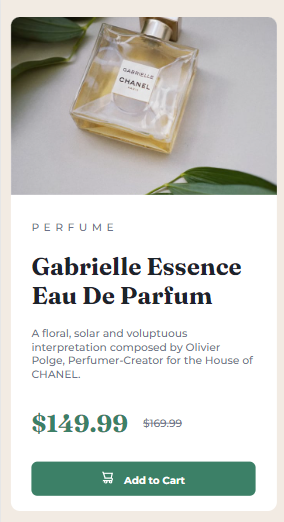

# Frontend Mentor - Product preview card component solution

This is a solution to the [Product preview card component challenge on Frontend Mentor](https://www.frontendmentor.io/challenges/product-preview-card-component-GO7UmttRfa). Frontend Mentor challenges help you improve your coding skills by building realistic projects. 

## Table of contents

- [Overview](#overview)
  - [The challenge](#the-challenge)
  - [Screenshot](#screenshot)
  - [Links](#links)
- [My process](#my-process)
  - [Built with](#built-with)
  - [What I learned](#what-i-learned)
  - [Continued development](#continued-development)
  - [Useful resources](#useful-resources)
- [Author](#author)
- [Acknowledgments](#acknowledgments)

## Overview

### The challenge

Users should be able to:

- View the optimal layout depending on their device's screen size
- See hover and focus states for interactive elements

### Screenshot
Normal state

Active state

Mobile design
<div style="text-align:center, margin-left: auto; margin-top: auto;"></div>.


### Links

- Solution URL: [Add solution URL here](https://your-solution-url.com)
- Live Site URL: [Add live site URL here](https://your-live-site-url.com)

## My process

### Built with

- Semantic HTML5 markup
- CSS custom properties

### What I learned

I now feel that I understand responsive web design more. As well as how I should implement it in my designs. I also learnt to add more comments to make my code more understandable for everyone.


```css
 .card-container{
    width: 600px;
    height: 450px;
    background-color: white;
    border-radius: 12px;
    display: flex;
    flex-direction: row;
    justify-content:space-between

   }
```
I learnt another way of using display flex property


### Continued development

I believe I need to start separating my css into different files as it will be easier for those going through my project.So that they understand where which content is and I will also start using comments a lot more often as this helps those understand the code a whole lot easier to read.


### Useful resources

- [Google fonts](https://fonts.google.com/) - I was able to add the two fonts Montserrat and Fraunces to this website using 

## Author


- Frontend Mentor - [@Hello-there 35](https://www.frontendmentor.io/profile/Hello-there35)


## Acknowledgments

I would like to thank Frontend Mentor for this interesting insightful challenge as it served as a great way to revise 
responsive web design.
